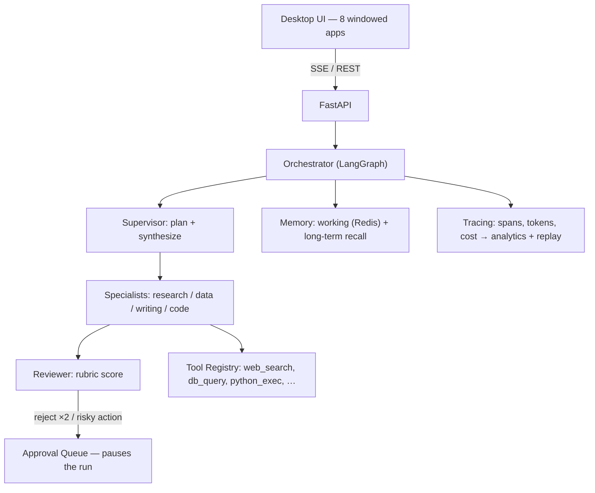

# Orchestrator — Agentic Orchestration Platform (Project 15)

A control room for autonomous multi-agent workflows: a **Supervisor** plans and
delegates to **Specialists**, a **Reviewer** grades output, working + long-term
**memory** make it improve over time, and low-confidence or risky steps
**escalate to a human** — every decision **traced, costed, and replayable**.

The UI is a **desktop-OS-in-the-browser**: a menu bar, a magnifying dock, and
draggable windows, one app per screen. Near-monochrome, custom cursor, no
third-party branding.

Spec: [`../project15-master-build-prompt.md`](../project15-master-build-prompt.md) ·
UI rules: [`../project15-design-guardrails.md`](../project15-design-guardrails.md)
(guardrails win on conflicts).

## Status — all phases complete ✅

| Phase | Scope | State |
|-------|-------|-------|
| 0 | Design system, desktop shell, live Agent Constellation | ✅ |
| 1 | Agent hierarchy, decomposition, tool registry, LangGraph | ✅ |
| 2 | Working + long-term memory, lifecycle, recall | ✅ |
| 3 | Human-in-the-loop: pausing queue, 4 graded levels, chat | ✅ |
| 4 | Tracing, trace explorer, cost tracking, replay | ✅ |
| 5 | 72-task dataset + eval harness (memory-improvement result) | ✅ |
| 6 | docker-compose, Playwright E2E, demo | ✅ |

## Architecture



## Quick start — one command

```bash
docker compose up --build
# open http://localhost:3000   (backend at http://localhost:8000)
```

Runs offline on the `echo` provider. For real answers, create `project15/.env`:

```
LLM_PROVIDER=groq
GROQ_API_KEY=<free key from https://console.groq.com/keys>
```

## Run it manually (dev)

```bash
# backend
cd backend && python -m venv .venv && .venv\Scripts\activate
pip install -r requirements.txt
uvicorn app.api.main:app --reload --port 8000

# frontend (new terminal)
cd frontend && npm install && npm run dev   # http://localhost:3000
```

## Tests

```bash
cd backend && pytest              # 35 unit + integration + e2e-of-the-graph
cd frontend && npm run test:e2e   # 4 Playwright E2E (needs the stack running)
```

## Demo walkthrough

With the stack up at http://localhost:3000:

1. **Command Center** opens on boot — the live Agent Constellation and current run.
2. **New Task** → type *"Compare three vendors' pricing and flag hidden fees"* →
   **Run task**. Watch the plan build, the constellation light up agent-by-agent,
   reasoning stream, and a **Final Answer** land.
3. **Trace Explorer** → open the run: the full span tree (recall → plan →
   subtasks → reviews → synthesize) with latency, tokens, and cost per node.
4. **Analytics** → cost/tool charts and the **Dataset eval** card: *memory
   recalled a relevant prior run on 100% of repeated tasks*.
5. **New Task** again, tick **"Require my approval of the plan first"**, run
   *"Reconcile the Q2 ledger…"* → it **pauses**. Open **Review Queue**, ask the
   agent a question, then **Approve / Modify / Take over** — the run resumes.
6. **Replay** → step through a past run's decisions, then **Re-run & diff**.
7. Run a task **similar to an earlier one** and watch **"Recalled N similar past
   tasks"** appear — memory improving planning, live.

## Repo layout

```
project15/
  frontend/            Next.js 16 + TS desktop UI (8 windowed apps)
  backend/             Python agent platform (see backend/README.md)
  docker-compose.yml   redis + backend + frontend, one command
```

## Design guardrails baked in

Anti-"vibecoded" rules are enforced in code: near-monochrome (one attention
colour), custom cursor, Onest (not Inter/Geist), Phosphor icons, no drop
shadows, tight radii, glow reserved to the one active constellation node,
`prefers-reduced-motion` respected throughout.
